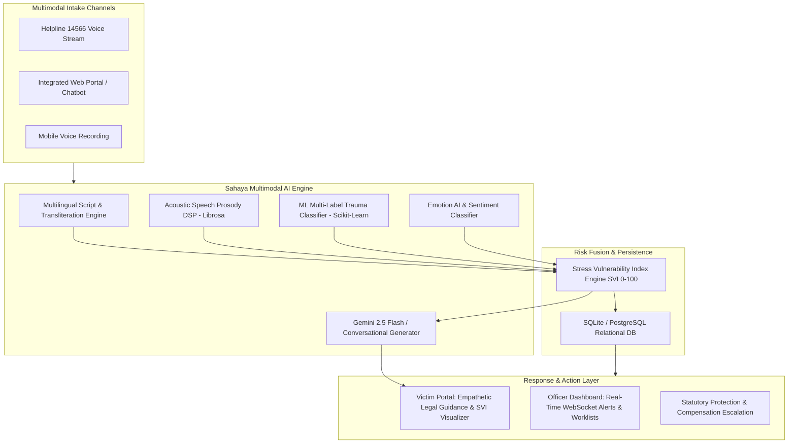

# 🛡️ SAHAYA AI 
### AI-Powered Multimodal Stress & Trauma Assessment System for Atrocity Redressal
**National Helpline Against Atrocities (NHAA 14566) · Ministry of Social Justice and Empowerment**

[](https://fastapi.tiangolo.com)
[](https://reactjs.org/)
[](https://scikit-learn.org/)
[](https://aistudio.google.com/)
[](https://librosa.org/)
[](https://opensource.org/licenses/MIT)

---

## 📌 Executive Summary

**Sahaya AI** is an intelligent, trauma-informed digital grievance intake and risk triage platform built for victims of caste-based violence, discrimination, and atrocities under the **Scheduled Castes and Scheduled Tribes (Prevention of Atrocities) Act, 1989**.

By fusing **Natural Language Processing (NLP)**, **Digital Signal Processing (DSP) Speech Prosody**, **Multilingual Emotion AI**, and **Generative AI (Google Gemini)**, Sahaya AI continuously computes a **Stress Vulnerability Index (SVI 0–100)** to prioritize life-threatening cases, dispatch real-time officer alerts, and guide victims toward immediate statutory protections, police escorts, legal aid, and financial relief.

---

## 🌟 Key Capabilities & Features

### 1. 🧠 Multimodal Stress Vulnerability Index (SVI)
* **Quantitative Risk Metric (0 to 100)** calibrated across 4 priority tiers: `LOW`, `MODERATE`, `HIGH`, and `CRITICAL`.
* **Multimodal Sensor Fusion**: Merges text semantic trauma indicators with acoustic voice features (f0 pitch jitter, pauses, RMS energy variance) for nuanced triage.
* **Safety Backstop Overrides**: Automatically escalates explicit suicidal ideation, stalking, or imminent physical danger to SVI `88.0+ (Critical)`.

### 2. 🎭 Multilingual Emotion AI & Voice Prosody
* **6 Indic Languages Supported**: Telugu (తెలుగు), Hindi (हिन्दी), Tamil (தமிழ்), Marathi (मराठी), Kannada (ಕನ್ನಡ), and English.
* **Granular Emotion Detection**: Detects `Fear & Threat`, `Acute Distress & Unease`, `Sadness & Grief`, `Anger & Outrage`, and `Calm / Neutral Inquiry`.
* **Acoustic Voice Prosody**: Real-time detection of vocal tremors, emotional choking, and agitation directly from microphone input.

### 3. 🤖 Dual-Core Conversational Intelligence
* **Google Gemini 2.5 Flash Integration**: Real-time generative responses with human-like situational empathy, validating victim emotions and providing contextual safety steps.
* **100% Offline Hybrid Engine**: Rule and slot-based fallback that runs zero-cost, private, and offline without requiring cloud API keys.

### 4. ⚖️ Statutory Legal & Welfare Guidance
* **Zero FIR Guidance**: Explains jurisdictional-free FIR registration and mandatory 60-day DSP-level investigation.
* **Section 15A Witness Protection**: Automatically triggers flags for police security, safe shelter, and travel escorts.
* **Statutory Compensation Calculator**: Outlines direct economic relief from **₹85,000 to ₹8,25,000** under Central DBT guidelines.

### 5. 🚨 Real-Time Officer Dashboard & Alert Dispatcher
* **Live WebSocket Broadcast**: Instant alert push to district response officers whenever high/critical trauma is detected.
* **Priority Worklists & Analytics**: Dynamic triage sorting by urgency, risk breakdown charts, and one-click alert acknowledgments.

---

## 🏗️ System Architecture



---

## 📂 Project Directory Structure

```
d:\SIH/
├── backend/
│   ├── ai/
│   │   ├── chat_assistant.py     # Gemini 2.5 Flash & conversational AI engine
│   │   ├── emotion_ai.py         # Multilingual Emotion AI classifier
│   │   ├── indicators.py         # Evidentiary trauma & atrocity indicator extractor
│   │   ├── model_loader.py       # ML model pipeline loader
│   │   ├── multilingual.py       # Script detection & Indic dictionary fallback
│   │   ├── speech_analytics.py   # Librosa acoustic voice prosody analysis
│   │   └── text_nlp.py           # NLP text tokenizer & cleaner
│   ├── api/
│   │   ├── alerts.py             # Alert acknowledgment endpoints
│   │   ├── assessment.py         # Victim assessment intake & Gemini config
│   │   ├── auth.py               # JWT registration & login
│   │   ├── officer.py            # Officer dashboard & SQL analytics
│   │   ├── privacy.py            # Consent management & data erasure
│   │   └── support.py            # Statutory support resources
│   ├── database/
│   │   ├── connection.py         # SQLAlchemy engine & SQLite connection
│   │   └── models.py             # DB schema (Users, Assessments, Alerts)
│   ├── ml/
│   │   ├── data_loader.py        # Balanced multi-class training data
│   │   ├── train.py              # ML model trainer & exporter
│   │   ├── trauma_model.py       # Multi-label trauma classifier
│   │   └── saved_models/         # Serialized .joblib models
│   ├── realtime/
│   │   └── websocket.py          # Real-time WebSocket officer alert server
│   ├── services/
│   │   ├── case_service.py       # Assessment orchestration pipeline
│   │   └── analytical_service.py # SQL aggregation analytics
│   ├── main.py                   # FastAPI application entry point
│   ├── requirements.txt          # Python dependencies
│   └── .env.example              # Environment configuration template
├── frontend/
│   ├── src/
│   │   ├── pages/
│   │   │   ├── Complaint.jsx     # Client Chatbot, SVI Gauge & Emotion Card
│   │   │   ├── Home.jsx          # Public portal landing page
│   │   │   ├── Login.jsx         # Role-based authentication
│   │   │   ├── Register.jsx      # Client & Officer self-registration
│   │   │   ├── Status.jsx        # Grievance tracker
│   │   │   ├── Support.jsx       # Emergency helpline directory
│   │   │   └── officer/
│   │   │       ├── Dashboard.jsx # Officer overview & live alert feed
│   │   │       ├── Alerts.jsx    # Real-time emergency alerts
│   │   │       ├── Cases.jsx     # Case investigation list
│   │   │       └── Reports.jsx   # Statutory reporting & metrics
│   │   ├── services/
│   │   │   ├── api.js            # Axios API client with JWT interceptor
│   │   │   └── websocket.js      # Live WebSocket client
│   │   ├── App.jsx               # React Router configuration
│   │   └── main.jsx              # React entry point
│   ├── package.json              # Frontend npm dependencies
│   └── vite.config.js            # Vite build configuration
└── README.md
```

---

## 🚀 Quick Start Guide

### Prerequisites
* **Python 3.10+**
* **Node.js 18+** & `npm`

---

### 1. Backend Setup

```bash
# Navigate to backend directory
cd backend

# Install Python dependencies
pip install -r requirements.txt

# Start the FastAPI server on port 8000
python -m uvicorn main:app --host 0.0.0.0 --port 8000 --reload
```

Backend API documentation will be available at: **`http://localhost:8000/docs`**

---

### 2. Frontend Setup

```bash
# Navigate to frontend directory
cd frontend

# Install dependencies
npm install

# Start the Vite development server on port 5173
npm run dev
```

Open your browser at: **`http://localhost:5173`**

---

## ⚙️ Environment Configuration (`.env`)

Create a `.env` file in the root or `backend/` directory:

```env
# Server Configuration
PORT=8000
HOST=0.0.0.0

# Database (Default: Local SQLite)
DATABASE_URL=sqlite:///./sih.db

# JWT Security
SECRET_KEY=sahaya-ai-secure-secret-token-key-2026

# Google Gemini API Key (Optional - for enhanced generative responses)
GEMINI_API_KEY=AIzaSy...your_gemini_api_key_here
```

> **Note**: You can also connect your Gemini API Key directly in the UI by clicking the **`⚡ Connect Gemini Key`** button in the header at `http://localhost:5173/complaint`.

---

## 📡 REST API Reference

| Method | Endpoint | Description | Auth Required |
|---|---|---|:---:|
| `POST` | `/auth/register` | Register as a Client (Victim) or Officer | No |
| `POST` | `/auth/login` | Authenticate and obtain JWT access token | No |
| `POST` | `/assessment/submit` | Submit text or voice for SVI & Emotion assessment | Optional |
| `GET` | `/assessment/{id}` | Retrieve historical assessment record | No |
| `POST` | `/assessment/config-gemini` | Dynamically configure Google Gemini API key | No |
| `GET` | `/officer/dashboard` | Summary triage metrics and recent cases | Officer JWT |
| `GET` | `/officer/worklist` | High/Critical priority case worklist | Officer JWT |
| `GET` | `/officer/analytics` | Risk, channel, and daily trend breakdowns | Officer JWT |
| `GET` | `/alerts/` | Fetch unacknowledged live emergency alerts | Officer JWT |
| `POST` | `/alerts/{id}/acknowledge` | Mark an alert as acknowledged | Officer JWT |
| `GET` | `/support/resources` | Fetch national helplines and legal directory | No |
| `WS` | `/ws/officer` | Live WebSocket stream for real-time alert broadcasts | No |

---

## 🔒 Security, Ethics & Privacy (DPDP Act Compliance)

* **Informed Consent Gates**: Clear consent checkpoints before recording voice or processing emotional indicators.
* **End-to-End Encryption**: Secure communication via HTTPS and encrypted WebSockets (`wss://`).
* **Role-Based Access Control (RBAC)**: Strict segregation between victim data intake and officer investigative portals.
* **Right to Erasure**: Dedicated `/privacy/request-erasure` endpoint enabling citizens to redact or delete intake records.
* **Zero Commercial Telemetry**: Complete local inference capabilities ensure that sensitive trauma data is never sold or repurposed.

---

## 👥 Contributors & Acknowledgements

Developed for the **Smart India Hackathon (SIH)** to empower victims of atrocities and support the institutional mission of the **National Helpline Against Atrocities (14566)**.
